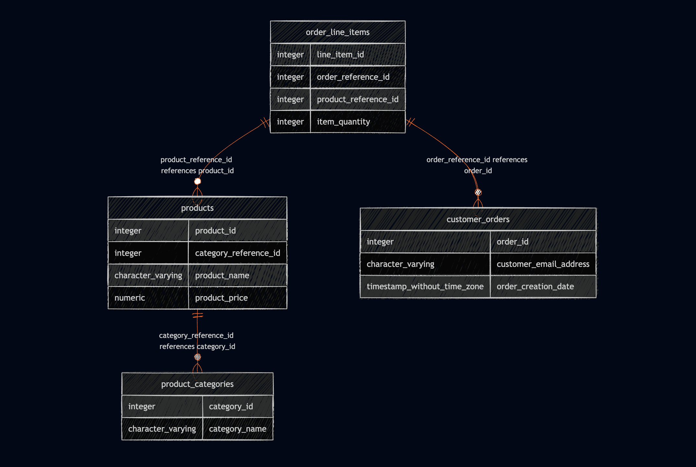

# pg2diagram: PostgreSQL Schema to ERD Generator

A command-line tool written in Go that connects to a live PostgreSQL database, securely extracts the internal system catalogs, and automatically generates a styled Entity-Relationship Diagram (ERD) using Mermaid.js syntax.



## Features
* **Live Catalog Parsing:** Queries PostgreSQL `information_schema` directly to extract tables, columns, data types, and foreign key constraints in real-time.
* **Intelligent Data Sanitization:** Automatically formats complex SQL data types (e.g., `character varying`) into Mermaid-compatible syntax.
* **Native Go Implementation:** Built with Go's standard library and the high-performance `pgx` driver.
* **Markdown Ready:** Outputs raw, styled Mermaid.js text that can be piped directly into `.md` files for instant use in GitHub READMEs, Notion, or Obsidian.

## Tech Stack
* **Language:** Go
* **Database Driver:** `github.com/jackc/pgx/v5`
* **Target Database:** PostgreSQL
* **Output Format:** Mermaid.js

## Installation

Clone the repository and build the binary:

```bash
git clone [https://github.com/Ashrita-Das/pg2diagram.git](https://github.com/Ashrita-Das/pg2diagram.git)
cd pg2diagram
go build -o pg2diagram .
